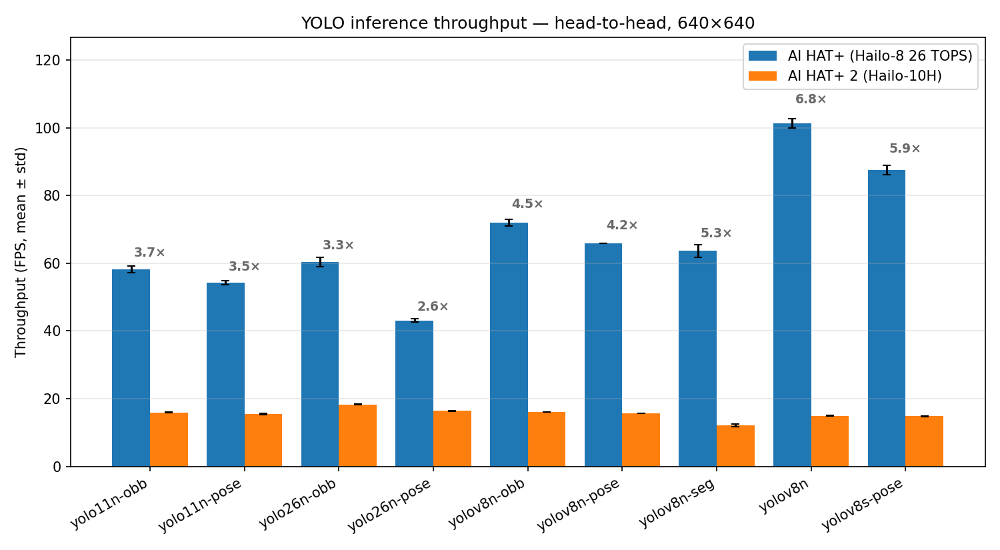
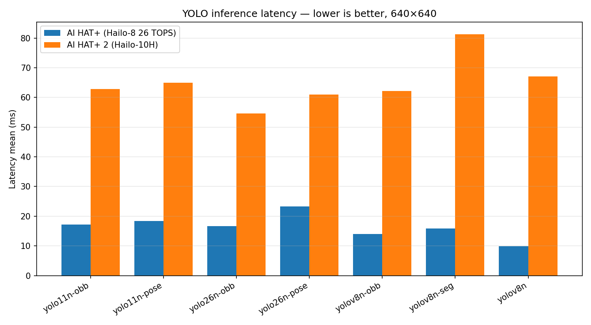
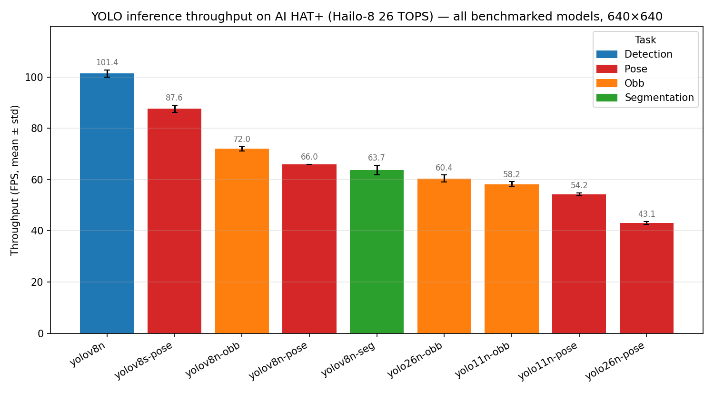
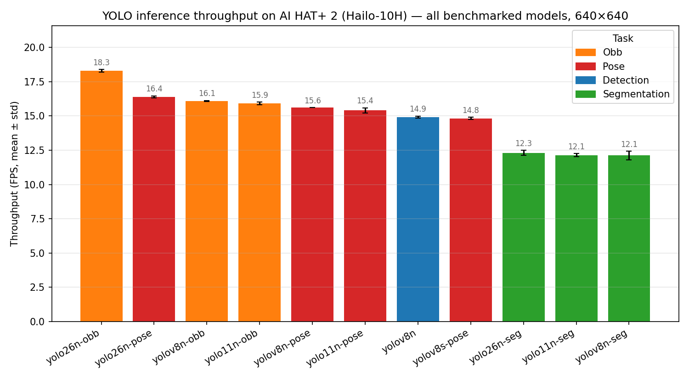
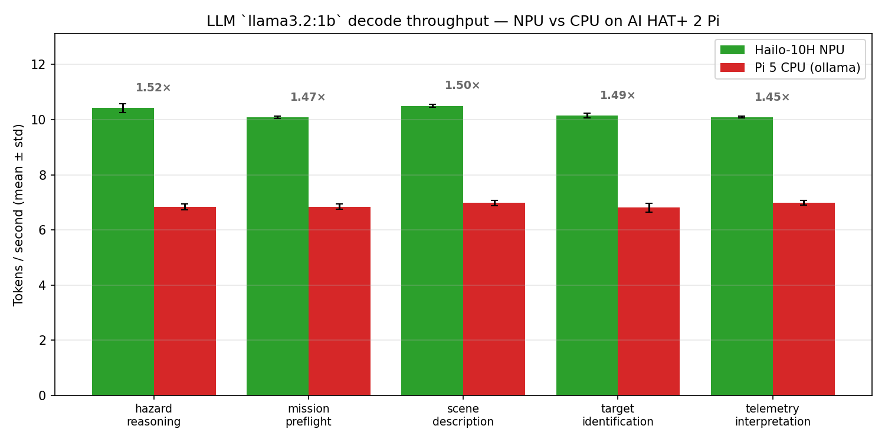
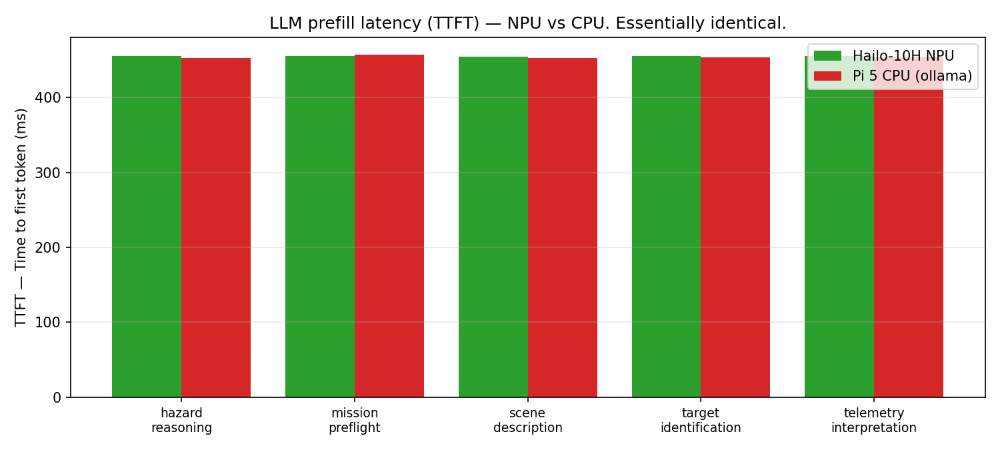

# Edge AI Benchmark Suite

A standardized, automated benchmarking framework to evaluate and compare AI inference capabilities across popular edge AI platforms.

## Results

Aggregated cross-platform results from real hardware runs are in
**[`docs/showcase.md`](docs/showcase.md)** — head-to-head YOLO
throughput, LLM NPU-vs-CPU speedup, embedded charts, and an
[interactive dashboard](docs/showcase/dashboard.html) you can open in
any browser.

**Headline prescription** (full breakdown + caveats in the showcase):

| Use case | Winner | Margin |
|---|---|---|
| Pure vision (det / OBB / seg / pose) | **AI HAT+ Hailo-8 (26 TOPS)** | **2.6× – 6.8× faster** than AI HAT+ 2 across every comparable model |
| LLM on NPU | **AI HAT+ 2 Hailo-10H** | Only choice — Hailo-8 has no onboard SDRAM. **1.49× decode speedup** vs Pi 5 CPU |
| Both vision AND LLM-on-NPU | **AI HAT+ 2 Hailo-10H** | Pay 2.6× – 6.8× vision throughput penalty for the LLM capability |

The Hailo-8 (26 TOPS) is vision-dedicated silicon with INT8 throughput
tuned for convnets. The Hailo-10H trades raw vision throughput for
40 TOPS at INT4 + 8 GB onboard SDRAM, which is what enables LLM
hosting at all. The data reflects exactly that engineering trade.













## Overview

This benchmark suite evaluates:

- **Computer Vision**: YOLO inference (v8, v11, v26) across all five
  tasks — detection, classification, OBB, segmentation, pose — on
  Hailo NPU, Jetson GPU, or PyTorch CPU.
- **Local LLM Inference** (llama-only). CPU side: `llama3.2:1b`,
  `llama3.2:3b`, `llama2:7b` via Ollama. NPU side: `llama3.2:1b` —
  the only llama-family prebuilt HEF in the HailoRT 5.3.0 GenAI Model
  Zoo. Cross-backend comparison happens at the 1B level.
- **Backend axis**: every `LLMResult` is tagged with a backend label
  (`ollama-cpu` / `ollama-cuda` / `hailo-10h`) and the dashboard splits
  CPU and NPU runs into separate filterable rows.

### Hailo task coverage

| YOLO Version | Detection | Classification | OBB | Segmentation | Pose |
|---|---|---|---|---|---|
| v8 | ✓ | ✓ | ✓ | ✓ | ✓ |
| v11 | ✓ | ✓ | ✓ | ✓ | ✓ |
| v26 | ✓ | ✓ | experimental | experimental | experimental |

Backend support (table) and HEF availability (which models actually
have prebuilts ready to run) are separate axes. The
[`hefs-v3`](https://github.com/JabbaghYounes/Benchy/releases/tag/hefs-v3)
release ships 35 prebuilt HEFs covering the verified cells, with
documented gaps for chip-unfittable combos. Full inventory + gap
explanations in [`docs/hailo.md`](docs/hailo.md#hef-availability-in-hefs-v3).

### Supported Platforms

| Platform | Accelerator | NPU TOPS | Host RAM | NPU RAM |
|----------|-------------|----------|----------|---------|
| NVIDIA Jetson Orin Nano Developer Kit | Ampere GPU | — | 8 GB | shared |
| Raspberry Pi 5 + AI HAT+ (13 TOPS) | Hailo-8L NPU | 13 (INT8) | 8 GB | uses host |
| Raspberry Pi 5 + AI HAT+ (26 TOPS) | Hailo-8 NPU  | 26 (INT8) | 8 GB | uses host |
| Raspberry Pi 5 + AI HAT+ 2            | Hailo-10H NPU | 40 (INT4) | 8 GB | 8 GB onboard SDRAM |

All three Hailo HATs connect to the Pi 5 via PCIe per the HAT+ spec.
Hailo-10H is the only variant with onboard SDRAM and the only one that
can host local LLMs / VLMs (~6B params) on the accelerator itself. See
[`docs/hailo.md`](docs/hailo.md) for vendor references and the per-board
setup story.

## Quick Start

```bash
git clone https://github.com/JabbaghYounes/Benchy.git
cd Benchy

# 1. Platform setup (sudo required — apt packages, udev rules, kernel
#    driver). --pull-models pre-pulls the three llama LLMs (~7 GB) so
#    LLM benchmarks run without a separate `ollama pull` step.
sudo ./scripts/setup_jetson_orin_nano.sh --pull-models
# OR for Raspberry Pi:
sudo ./scripts/setup_rpi_ai_hat_plus.sh --pull-models      # Hailo-8 / 8L
sudo ./scripts/setup_rpi_ai_hat_plus_2.sh --pull-models    # Hailo-10H

# 2. Activate the venv (mandatory on Pi OS Bookworm — PEP 668 blocks
#    system-wide pip).
source venv/bin/activate

# 3. Run benchmarks
python -m benchmark run all                   # quick (default profile)
python -m benchmark run all --profile full    # comprehensive

# 4. Hardware verification (Hailo boards) — 14-step sweep with
#    per-step logs, JSON validation, and a final pass/fail summary.
#    Output lands in results/<platform>/hw_verify_<timestamp>/ and
#    already includes an auto-generated dashboard at report/.
./scripts/verify_ai_hat_plus.sh      # AI HAT+ (Hailo-8 / 8L)
./scripts/verify_ai_hat_plus_2.sh    # AI HAT+ 2 (Hailo-10H)

# 5. Plot results — aggregate the per-run JSON/CSVs in results/ into
#    summary tables + a self-contained HTML dashboard with charts and
#    Backend / Platform / Task filter chips. `report` is `aggregate`
#    + `dashboard` combined; open the resulting HTML in any browser.
#    (Step 4's verify scripts already produce a dashboard per bundle —
#    this step is for ad-hoc `run all` outputs from step 3.)
python -m benchmark report
# Or run the stages individually:
python -m benchmark aggregate                 # group-safe summary CSVs
python -m benchmark dashboard                 # self-contained HTML

# Cross-platform comparison from a list of per-run JSONs (e.g. one
# bench_*.json copied off each Pi after step 3 / step 4):
python -m benchmark verify results/bench_*.json
```

> **AI HAT+ 2 caveat (Pi OS Bookworm).** The setup script can't fully
> install HailoRT 5.x because Raspberry Pi's apt repo caps at 4.20.0.
> The script reports SUCCESS but leaves the Hailo-10H invisible
> (`/dev/hailo0` missing). Manual procedure (free Hailo Developer Zone
> account required) in
> [`docs/hailo.md` § "LLM on Hailo-10H → Setup (high level)"](docs/hailo.md#setup-high-level).

## Benchmark Profiles

| Profile | YOLO | LLM | Use Case |
|---------|------|-----|----------|
| **default** | v8 detection, nano size | llama2:7b (bare tag, no quant sweep) | Quick CPU smoke test |
| **full** | All versions, all tasks, all sizes | llama3.2:1b + llama3.2:3b + llama2:7b (1B / 3B / 7B llama groups) | Thorough evaluation |
| **drone** | v8/v11/v26 detection at 1280, sizes n/s/m, VisDrone dataset | llama2:7b on the curated drone prompt set (scene / target / mission / telemetry / hazard) | Realistic small-object aerial detection |
| **drone_full** | Detection + OBB + seg + pose at 1280, sizes n/s — broadest drone-relevant Hailo sweep | _(YOLO-only)_ | Exercises every Phase 3 task at altitude-realistic resolution |
| **npu** | _(LLM-only)_ | llama3.2:1b on the Hailo-10H NPU via HailoRT GenAI on `:8000`, drone prompt set | LLM-on-NPU comparison row (AI HAT+ 2 only) |
| **compare** | _(LLM-only)_ | llama3.2:1b on Ollama CPU + drone prompt set — RAM-safe CPU mirror of the `npu` profile | True 1B-vs-1B cross-backend comparison row; used by `verify_ai_hat_plus_2.sh` |

Configured in `configs/yolo_benchmark.yaml` and
`configs/llm_benchmark.yaml`. Full field reference in
[`docs/cli.md`](docs/cli.md) and [`docs/workloads.md`](docs/workloads.md).

## Key Assumptions

1. **Native installation** — Benchmarks run natively on target hardware, not in containers
2. **Single device** — One benchmark instance per device at a time
3. **Stable power** — Consistent power supply during benchmarking
4. **Thermal stability** — Allow device to reach thermal equilibrium before full runs
5. **LLM server** — CPU-side LLM benchmarks require Ollama on `localhost:11434`; the `npu` profile additionally requires the HailoRT GenAI server (`hailo-ollama`) on `localhost:8000`. See `docs/hailo.md` for setup
6. **Network isolation** — No network-dependent operations during benchmarks

## Documentation

| Document | Description |
|----------|-------------|
| [Showcase](docs/showcase.md) | **Cross-platform aggregated results** — head-to-head AI HAT+ vs AI HAT+ 2 with charts, tables, interactive dashboard |
| [CLI Reference](docs/cli.md) | Full command reference with examples |
| [Workloads](docs/workloads.md) | YOLO and LLM benchmark details, metrics, and model groups |
| [Hailo NPU](docs/hailo.md) | Hailo-8 / 8L / 10H integration, model conversion, HEF inventory, and limitations |
| [HEF Compilation](docs/hef_compilation.md) | Workstation-side `.pt → .hef` workflow, CLI flags, calibration options |
| [NVIDIA Workstation Bring-up](docs/compilation/nvidia_workstation_setup.md) | Step-by-step setup for a CUDA-equipped compile box (required for gap-model HEFs) |
| [Compilation Pitfalls](docs/compilation/pitfalls.md) | Known compilation failure modes and fixes |
| [Methodology](docs/methodology.md) | Benchmark methodology and reproducibility |
| [Output & Configuration](docs/output.md) | Result formats, dashboard, and YAML configuration |
| [Troubleshooting](docs/troubleshooting.md) | Common issues and fixes |

## Dependencies

### Core
- psutil >= 5.9.0
- requests >= 2.28.0
- pyyaml >= 6.0
- numpy >= 1.21.0
- ultralytics >= 8.0.0
- onnx >= 1.14.0, onnxruntime >= 1.15.0 (drive the `.pt → .onnx → .har → .hef` Hailo conversion pipeline; pinned in `setup.py:install_requires`)

### Hailo NPU (Raspberry Pi only)
- hailo-platform >= 4.17.0 (HailoRT SDK)
- hailo-dataflow-compiler >= 3.26.0 (for model compilation)

## Contributing

1. Fork the repository
2. Create a feature branch
3. Make your changes
4. Validate locally with `black benchmark/`, `mypy benchmark/`, and `pytest tests/` (after `pip install -e ".[dev]"`)
5. Submit a pull request

## License

MIT License - see LICENSE file for details.
